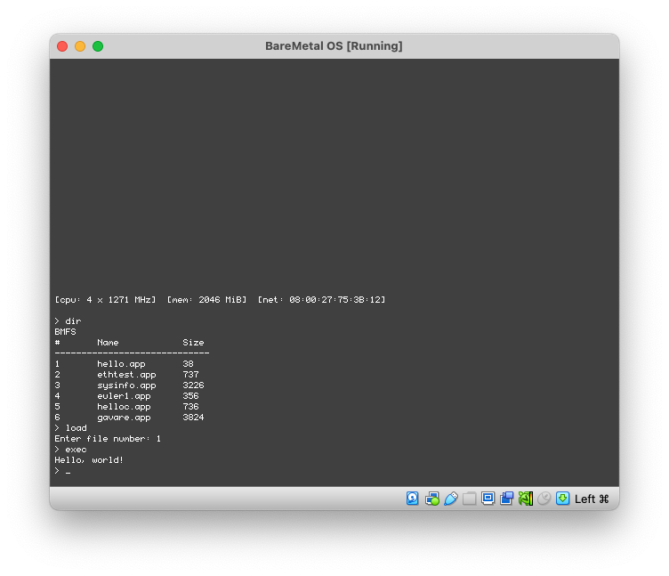

	</img>
	</img>

## About

BareMetal OS is an exokernel-based operating system crafted entirely in x86-64 assembly and is designed to provide unparalleled levels of flexibility and efficiency. By exposing hardware resources directly to applications, it empowers developers to finely tune and optimize their software for specific tasks. With the exokernel's minimalist design, it minimizes the overhead imposed by traditional operating systems, enabling applications to achieve peak performance. Its x86-64 assembly implementation speaks to its commitment to squeezing every ounce of performance from the hardware, making it a compelling choice for those who demand the utmost control and efficiency from their computing environments.

	</img>

## Prerequisites

The script in this repo depends on a Debian-based Linux system like [Ubuntu](https://www.ubuntu.com/download/desktop) or [Elementary](https://elementary.io). macOS is also supported to build and test the OS and Assembly applications if you are using [Homebrew](https://brew.sh).

- [NASM](https://nasm.us) - Assembly compiler to build the loader and kernel, as well as the apps written in Assembly.
- [QEMU](https://www.qemu.org) - Computer emulator if you plan on running the OS for quick testing.
- [GCC](https://gcc.gnu.org) - C compiler for building C/C++ applications.
- [Git](https://git-scm.com) - Version control software for pulling the source code from GitHub.

Optional:
- [mtools](https://www.gnu.org/software/mtools/) - Utilities to access DOS disks in Unix. This is only required if you plan on using UEFI.

In Linux this can be completed with the following command:

	sudo apt install nasm qemu-system-x86 gcc git

In macOS via Homebrew this can be completed with the following command:

	brew install nasm qemu gcc git
 

## Summary

BareMetal OS consists of several different projects:

- [Pure64](https://github.com/ReturnInfinity/Pure64) - The boot sector and software loader.
- [BareMetal](https://github.com/ReturnInfinity/BareMetal) - The kernel.
- [Monitor](https://github.com/ReturnInfinity/BareMetal-Monitor) - A simple command line interface.
- [BMFS](https://github.com/ReturnInfinity/BMFS) - The BareMetal File System utility.
- [BareMetal-Demo](https://github.com/ReturnInfinity/BareMetal-Demo) - Various demo programs.

## Initial configuration

	git clone https://github.com/ReturnInfinity/BareMetal-OS.git
	cd BareMetal-OS
	./baremetal.sh setup

`baremetal.sh setup` automatically runs the build and install functions. Once the setup is complete you can execute `baremetal.sh run` to verify that everything installed correctly.

## Rebuilding the source code

	./baremetal.sh build

## Installing the system to the disk image

	./baremetal.sh install

This command installs the boot sector, loader (Pure64), kernel, and simple command line interface (Monitor) to the disk image. If you want to attach your own binary to the end of the kernel you can use `./baremetal.sh install mybinary.bin`

## Installing the demos to the disk image

	./baremetal.sh demos

This command installs the demo programs to the disk image.

## Test the install with QEMU

	./baremetal.sh run

## Test the install with QEMU via UEFI (Experimental)
	
	./baremetal.sh run-uefi

This command relies on `mtools` to create a disk image formatted with FAT.

## Build a VMDK disk image for VMware

	./baremetal.sh vmdk

## Build a VDI disk image for VirtualBox

	./baremetal.sh vdi

The VDI script rewrites the disk ID of the VDI file to avoid the disk warning in VirtualBox.

## Test the install with Bochs

	bochs -f bochs.cfg

Notes:
- The `bochs.cfg` file may need to be adjusted for your usage. It was created for a Linux-based system.
- `display_libary` is set to use `x` for X Windows with the GUI Debugger by default. On macOS or Windows you will need to use `sdl2` with no additional options.
- The file paths for `romimage` and `vgaromimage` will need to be updated if the Bochs BIOS files are in a different location.

// EOF
