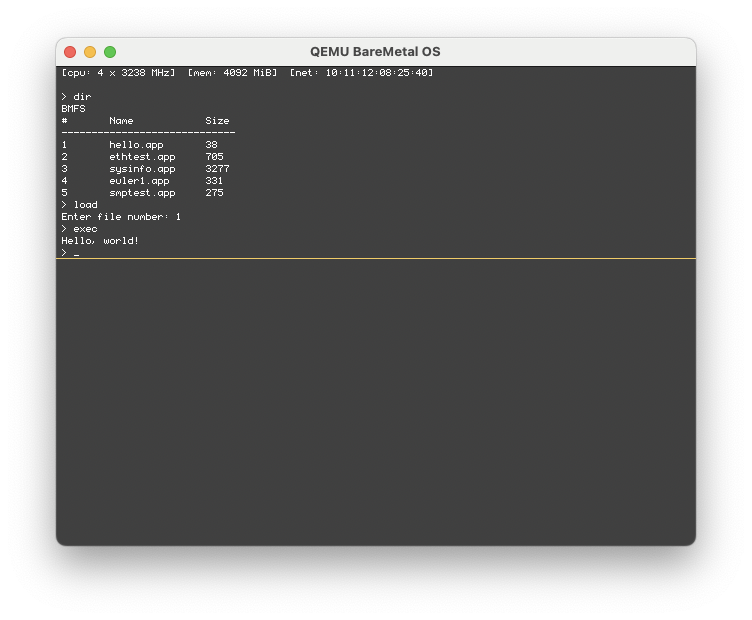

<p align="center">
	</img>
	</img>
	</img>
</p>

[Discuss this project here](https://github.com/ReturnInfinity/BareMetal-OS/discussions)

**BareMetal OS** is an exokernel-based operating system crafted entirely in x86-64 assembly and is designed to provide unparalleled levels of flexibility and efficiency. By exposing hardware resources directly to applications, it empowers developers to finely tune and optimize their software for specific tasks. With the exokernel's minimalist design, it minimizes the overhead imposed by traditional operating systems, enabling applications to achieve peak performance. Its x86-64 assembly implementation speaks to its commitment to squeezing every ounce of performance from the hardware, making it a compelling choice for those who demand the utmost control and efficiency from their computing environments.

> [!NOTE]
>
> **BareMetal OS** is under active development. Some physical hardware configurations may not work correctly.

### Table of Contents

- [Prerequisites](#prerequisites)
- [Components](#components)
- [Supported hardware](#supported-hardware)
- [Initial configuration](#initial-configuration)
- [Building the source code](#building)
- [Installing](#installing)
  - [Installing the system](#installing-the-system)
  - [Installing the demos](#installing-the-demos)
- [Running on a virtual system](#running-on-a-virtual-system)
  - [QEMU](#qemu)
  - [QEMU via UEFI](#qemu-via-uefi)
  - [QEMU - Second Instance](#qemu-second-instance)
  - [VMware](#vmware)
  - [VirtualBox](#virtualbox)
  - [Bochs](#bochs)
- [Running on a physical system](#running-on-a-physical-system)


# Prerequisites

The script in this repo depends on a Debian-based Linux system like [Ubuntu](https://www.ubuntu.com/download/desktop) or [Elementary](https://elementary.io). macOS is also supported to build and test the OS, as well as the Assembly applications, if you are using [Homebrew](https://brew.sh).

- [NASM](https://nasm.us) - Assembly compiler to build the loader and kernel, as well as the apps written in Assembly.
- [QEMU](https://www.qemu.org) - Computer emulator if you plan on running the OS for quick testing.
- [GCC](https://gcc.gnu.org) - C compiler for building C/C++ applications.
- [Git](https://git-scm.com) - Version control software for pulling the source code from GitHub.
- [mtools](https://www.gnu.org/software/mtools/) - Utilities to access DOS (FAT32) disk images in Unix.

In Linux this can be completed with the following command:

	sudo apt install nasm qemu-system-x86 gcc git mtools

In macOS via Homebrew this can be completed with the following command:

	brew install nasm qemu gcc git mtools

 
# Components

BareMetal OS consists of several different projects:

- [Pure64](https://github.com/ReturnInfinity/Pure64) - The software loader.
- [BareMetal](https://github.com/ReturnInfinity/BareMetal) - The kernel.
- [Monitor](https://github.com/ReturnInfinity/BareMetal-Monitor) - A simple command line interface.
- [BMFS](https://github.com/ReturnInfinity/BMFS) - The BareMetal File System utility.
- [BareMetal-Demo](https://github.com/ReturnInfinity/BareMetal-Demo) - Various demo programs.


# Supported Hardware

* CPU
  * Multi-core on 64-bit x86 systems (Intel/AMD)
* Bus
  * PCIe
  * PCI
  * xHCI (USB 3)
* Network
  * Gigabit
    * Intel 8254x Gigabit (e1000)
    * Intel 8257x Gigabit (e1000e)
    * Intel 8259x 10 Gigabit (ixbge)
    * Realtek 816x/811x Gigabit (rtl8169)
  * Virtual
    * Virtio-Net
* Storage
  * NVMe
  * AHCI (SATA)
  * IDE
  * Virtio-Blk
* HID (Human Interface Devices)
  * PS/2 Keyboard
  * PS/2 Mouse
  * USB Keyboard


# Initial configuration

	git clone https://github.com/ReturnInfinity/BareMetal-OS.git
	cd BareMetal-OS
	./baremetal.sh setup

`baremetal.sh setup` automatically runs the build and install functions. Once the setup is complete you can execute `baremetal.sh run` to verify that everything installed correctly.


# Building

	./baremetal.sh build

This command builds the boot sector, loader (Pure64), kernel, and simple command line interface (Monitor) to the disk image. If you want to attach your own binary to the end of the kernel you can use `./baremetal.sh build mybinary.bin`

# Installing

## Installing the system

	./baremetal.sh install

This command installs the software to the disk image.

## Installing the demos

	./baremetal.sh demos

This command installs the demo programs to the disk image.


# Running on a virtual system

## QEMU

	./baremetal.sh run

## QEMU via UEFI
	
	./baremetal.sh run-uefi

## QEMU - Second Instance

	./baremetal.sh run-2

Running a cloned second instance is useful for testing network connectivity between QEMU systems.

## VMware

	./baremetal.sh vmdk

## VirtualBox

	./baremetal.sh vdi

Notes:
- The VDI script rewrites the disk ID of the VDI file to avoid the disk warning in VirtualBox.
- The `Chipset Type` for the VirtualBox VM must be `ICH9`
- The `Storage Controller` should be `ACHI (SATA)` or `NVMe (PCIe)`

## Bochs

	bochs -f bochs.cfg

Notes:
- The `bochs.cfg` file may need to be adjusted for your usage. It was created for a Linux-based system.
- `display_libary` is set to use `x` for X Windows with the GUI Debugger by default. On macOS or Windows you will need to use `sdl2` with no additional options.
- The file paths for `romimage` and `vgaromimage` will need to be updated if the Bochs BIOS files are in a different location.


# Running on a physical system

Booting via BIOS and UEFI is supported. Secure boot in UEFI mode must be disabled since this software isn't signed. You may need to press <kbd>DEL</kbd> or <kbd>F12</kbd> on the keyboard on power-up to select the boot drive.

Debug logging is output via the serial port (115200 bps, 8 data bits, 1 stop bit, no parity, no flow control). The output should look similar to this:
```
[ Pure64 ]
boot bios
pml4 ok
acpi ok
bsp ok
pic ok
smp ok
kernel start

[ BareMetal ]
64
bus
nvs
net
system ready
```

> [!IMPORTANT]
> Booting from a floppy or USB drive works. For BIOS-based floppy boot and UEFI-based USB drive booting there is a RAM drive image loaded that contains the demo programs.

> [!CAUTION]
> Doublecheck that you are writing the disk image to the correct disk

	dd if=baremetal_os.img of=/dev/sdc

Once the disk image is written you can install the disk in the system and boot from it.


// EOF
